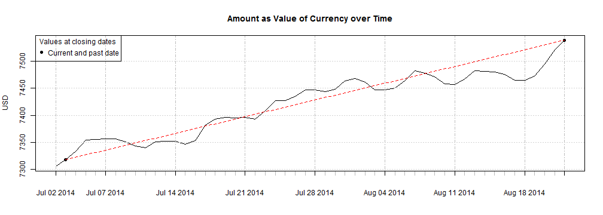

### Introduction 
---
## Determinants of exchange rate 
---
### __Economic factors__

- Economic policy, controlled and set by government agencies and central banks. 
- Economic conditions, e.g., balance of trade, inflation, economic growth and health, productivity of an economy

### __Political conditions__

- Internal, regional, and international political circumstances and events, e.g., destabilization of the political situation in Ukraine can negatively affect the value of its currency.

### __Market psychology__

- Market psychology and trader perceptions, e.g., long-term trends, technical trading considerations, "Buy the rumor, sell the fact". 

--- .class #id 

### Exchange rate visualization
---
## Can I predict exchange rates?
---
### __Let us check this [Shiny App](http://berniepilgram.shinyapps.io/CourseProjects_FXRate/) on exchange rates__

- Choose from a set of currencies you want to exchange and check how the currency exchange rate changes over time, for example: 10,000 USD -> EUR at closing date August 22, 2014 and 
50 days prior.

 

### Ready to join the team?

--- &radio
### Exchange rates over time - Are you ready to join the team?
---
### USD/EUR exchange rate on Juli 03, 2014
---
How much money did you loose when you changed 10,000 USD to EUR on Juli 03, 2014 compared to closing date August 22, 2014?

1. 100.01 USD
2. _221_ USD
3. 76.34 USD
*** .hint
Please check the previous slide!
*** .explanation
Are you ready to join the team?

--- .class #id 

### Research Project and Capstone Project
---
## Modeling of exchange rate behaviour 
---
### 1. Review of current theories and models

- International parity conditions, e.g., Relative Purchasing Power Parity
- Balance of payments model, Asset market model, algorithmic trading models

### 2. Development of an exchange-rate model

- Regression analysis (linear, non-linear) of economic factors and variables to model economic factors, a combination of both classical and Bayesian models will be considered.  
- Strategic Reasoning to model (1) political conditions and (2) market psychology

### 3. Deployment of model at webserver

- User friendly setup: User can choose from a set of economic factors and variables, and from a set of decision points for Strategic Reasoning

